# 0.23 codec update flag state machine

Flag address: `0x200162b4`. Sources: `EQ_BUSY_FLAG_LIFECYCLE.md`, cached
official-0.23 disassembly, and `codec-scheduler-audit.py` output. This report
does not alter the flag or contact a device.

## CONFIRMED

| State/transition | Evidence |
|---|---|
| Idle `0` → transaction `1` | `hw_codec_iir_set_cfg` writes 1 at `0x20a478` before programming banks. |
| Transaction `1` → idle `0` on success | After acknowledgement bit 24 at `0x20a76a`/`0x20a844`, code clears at `0x20a774` and toggles software bank selection. |
| Transaction `1` → remains set on stock status-3 exits | `0x20a5ea` and `0x20a78c` return without reaching `0x20a774`. |
| Transaction `1` → remains set while ACK never arrives | Both stock ACK loops are unbounded and never reach cleanup in that case. |
| Lifecycle clear | `0x20a884` writes 0 only in the already-initialized codec-enable branch; disable does not clear it. |
| Setter's local observation | `0x20a47a` reads the byte after setting it; the modified E1 preflight separately reads it and refuses when nonzero. |
| Address references | The three initialized-RAM literal references resolve to setter set/clear and lifecycle clear. BSS bulk initialization and indirect peripheral behavior are outside this index. |

```mermaid
stateDiagram-v2
    Idle: busy = 0
    Owned: busy = 1; setter owns IIR transaction
    Stale: busy = 1; no proven active transaction
    Idle --> Owned: setter starts at 0x20a478
    Owned --> Idle: ACK success, 0x20a774
    Owned --> Stale: error return or missing ACK
    Stale --> Idle: later codec enable path may clear at 0x20a884
```

## INFERRED

- This is a transaction-in-progress byte, not a runtime EQ enable flag.
- A stale `1` can persist indefinitely after the documented error exits or missing ACK.
- During normal playback it should remain zero unless a codec configuration transaction is in progress; no periodic normal-playback clear was found.
- The physical guard trace proves the value was nonzero when E1 rejected, but not which writer last set it or how long it had been set.

## UNVERIFIED

- Whether the observed nonzero value was transient or stale, whether it later cleared, and which transaction produced it.
- Whether startup BSS initialization covers this address; the initialized-RAM reconstruction excludes BSS.
- The hardware register's exact acknowledgement edge semantics and the state of the inactive bank on failure.
- Whether every possible writer/read outside mapped initialized RAM has been captured, including runtime pointer aliases and interrupt/DMA effects.

## DISPROVEN

- Clearing the byte manually or invoking the codec-enable helper as a flag reset is safe. Neither action proves the hardware transaction is quiescent.
- Waiting in a spin loop in USB EP0 or audio-frame context is safe. A nonzero byte may be stale forever, while the stock ACK loops themselves are unbounded.
