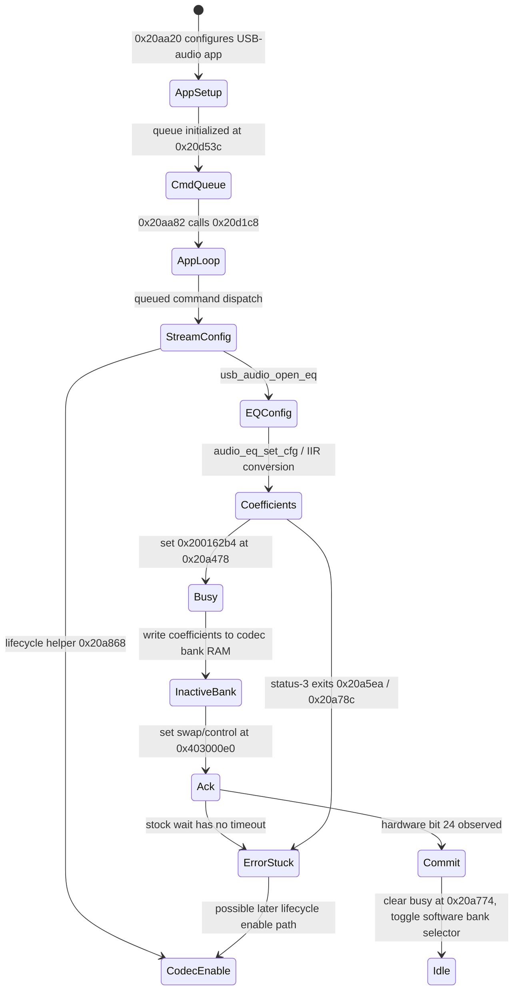

# EO-IC100 0.23 codec and EQ lifecycle

Offline reconstruction from the existing hash-locked initialized-RAM cache,
`eq-call-graph.json`, and `EQ_BUSY_FLAG_LIFECYCLE.md`. No device access or
firmware modification.

## CONFIRMED

The reviewed path is:

- Queue consumer `0x20d1c8` dispatches audio configuration events. Several branches invoke `usb_audio_open_eq`; the reviewed open-EQ call sites are all under this command dispatch path.
- `usb_audio_open_eq` calls `usb_audio_set_eq`; coefficient conversion then reaches `hw_codec_iir_set_cfg` at `0x20a424`.
- The setter checks codec-initialized state, sets `0x200162b4` to 1 at `0x20a478`, prepares IIR coefficients, writes codec coefficient RAM, updates the swap/control register `0x403000e0`, polls hardware acknowledgement bit 24, clears the flag at `0x20a774`, and toggles the software bank selector after acknowledgement.
- Stock waits at `0x20a76a` and `0x20a844` are unbounded. Status-3 returns at `0x20a5ea` and `0x20a78c` bypass normal cleanup.
- Codec lifecycle helper `0x20a868` has an initialized+enable branch that clears the transaction byte at `0x20a884` while updating codec state. This is not a standalone abort API. The disable path does not clear the busy byte.
- The experimental hardened handler bounds its two ACK waits, but its finite loop's wall-clock cost and scheduling impact have not been measured on firmware.

## INFERRED

- A natural, successful setter invocation owns a two-bank transaction: coefficients are prepared in the non-current bank and the active bank changes only after the hardware acknowledges the swap.
- Queued stream configuration and EQ operations are serialized relative to one another within the command consumer. This is the best candidate location for a new deferred command.
- Re-enabling the codec may recover a stale software state only as part of normal codec lifecycle work. Calling the helper solely to clear `0x200162b4` would bypass the transaction invariant and is rejected.

## UNVERIFIED

- The complete cold-boot codec initialization sequence and all interrupt/timer callers outside the initialized-RAM call graph.
- Exact task priority and whether the command loop can be preempted by audio frames during a bounded hardware wait.
- Whether real hardware always keeps the previous bank active when an ACK times out, including the state of the swap bit and partially written inactive bank.
- Whether error returns leave hardware coefficients unchanged. The software selector is not toggled on the known failure branches, but hardware-side consequences have not been emulated at register level.
- Whether the busy flag clears naturally after the physical trace's rejected E1; the saved trace is a point-in-time sample only.

## DISPROVEN

- A software-only “reset busy” operation: no safe transaction-abort routine was found; the only stock clear outside normal ACK completion is coupled to codec re-enable.
- Direct register/bank writes as a safe workaround: they would duplicate or bypass the setter's serialization, ACK, and selector bookkeeping.
- Calling the synchronous setter from the EP0 callback or `af_thread`: the former blocks USB control completion; the latter risks frame overrun.

## EQ invocation model — offline call-graph review

**CONFIRMED:** the reviewed direct chain has one call from `usb_audio_open_eq` to `usb_audio_set_eq`, then one chain through `audio_eq_set_cfg` to `hw_codec_iir_set_cfg`. There are seven stock `usb_audio_open_eq` call sites, all under the USB-audio command consumer or helpers it invokes. This is a static call-site count, not a count of executions per boot/session. Each setter execution prepares and writes coefficients into codec bank RAM before requesting the bank operation; it is not restricted by the code to cold boot.

**INFERRED:** the compiled EQ is a fixed preset selected by the stock USB-audio open/configuration path, rather than a general user-facing live-EQ interface. The busy byte is a transaction guard: stock success clears it after hardware ACK, and a separate initialized+enable lifecycle path also clears it. There is no evidence that firmware intends it to remain set as a normal persistent playback state.

**UNVERIFIED:** exact invocation frequency in ordinary sessions; whether a stock command causes `usb_audio_open_eq` after initial configuration while samples are actively streaming; whether a natural disable/re-enable sequence also reissues the EQ setter; and whether coefficient RAM is reloaded on every codec-enable event that does not pass through the setter.
